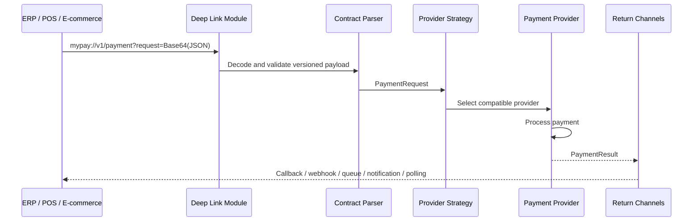
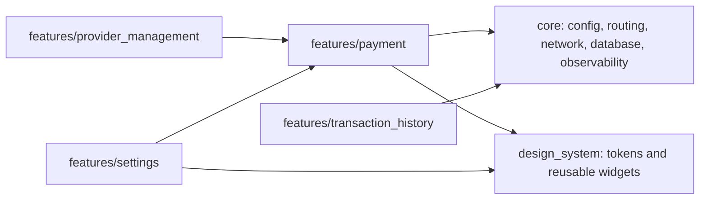
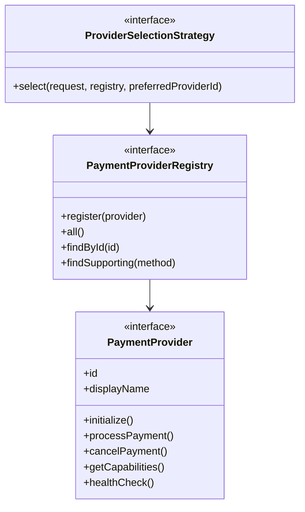

# EasyPay Architecture

EasyPay is a payment integration platform. It is not a wallet, bank, or
marketplace. Its job is to receive a third-party payment request, route it to a
payment provider, and return the result through one or more channels.

## Runtime Flow

## Module Boundaries

## Provider Plugin Model

Providers implement `PaymentProvider`:

- `initialize()`
- `processPayment()`
- `cancelPayment()`
- `getCapabilities()`
- `healthCheck()`

The registry owns discovery. Selection is delegated to a strategy. That keeps
new providers open for extension without changing the payment processor.

## Scaling To 50+ Providers

1. Keep every provider in its own infrastructure package or folder.
2. Expose one provider module per provider, for example `CieloProviderModule`.
3. Register modules through composition at app startup, not inside the payment
   processor.
4. Store capabilities as data so routing can query features without provider
   type checks.
5. Keep certification logic, keys, pinning, and SDK adapters isolated per
   provider.
6. Use contract tests shared by all providers: capability contract, happy path,
   cancellation, timeout, idempotency, and error mapping.
7. Version incoming contracts under the deep link module: `v1`, `v2`, `v3`.
8. Add remote config only to choose provider order and strategies, never to
   mutate domain rules at runtime.

## Code Generation

The project includes Freezed, Json Serializable, Drift, and build_runner. The
first implementation keeps core domain objects handwritten to make the skeleton
readable. When generated models are introduced, keep generated files within each
vertical slice and do not leak DTOs into domain interfaces.
